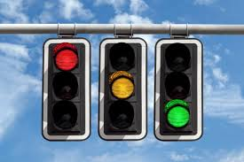

# Red Light Violation Detection System

## Project Overview
This project implements an automated system for detecting and processing red light violations at traffic intersections. The system captures images of vehicles that violate red light signals, extracts license plate information, stores violation data in a database, and notifies violators via SMS.

## Key Features
- **Violation Detection**: Monitors traffic light junctions and captures images when vehicles cross during red signals
- **License Plate Recognition**: Identifies and extracts license plate regions from vehicle images
- **Optical Character Recognition (OCR)**: Converts license plate images to text
- **Database Integration**: Stores violation records including date, time, location, license plate number, and vehicle image
- **SMS Notification**: Automatically sends violation notices to registered vehicle owners

##Prerequisites
Make sure that the program runs on Python version not more than Python 3.9
For the required Python packages please see <u>requirements.txt</u>.  

## Technical Implementation

### Hardware Components
- High-resolution cameras positioned at traffic intersections
- Processing server with GPU support for image processing
- Network infrastructure for data transmission

### Software Components
1. **Image Acquisition Module**
   - Interfaces with traffic cameras
   - Triggers image capture based on traffic light status and vehicle movement

2. **License Plate Detection**
   - Uses computer vision algorithms to identify potential license plate regions
   - Implements region proposal techniques to isolate license plate areas

3. **OCR Processing**
   - Pre-processes license plate images (normalization, noise reduction)
   - Applies OCR to extract alphanumeric characters

4. **Database Management**
   - Stores violation records in a structured database
   - Maintains vehicle owner information and contact details

5. **Notification System**
   - Interfaces with SMS gateway
   - Generates and sends violation notices

## System Workflow
1. System detects vehicle crossing intersection during red light
2. Camera captures high-resolution image of the violation
3. Image processing identifies the license plate region
4. OCR extracts the license plate number
5. System queries database for vehicle owner information
6. Violation record is created and stored
7. SMS notification is sent to the registered owner

## Future Enhancements
- Integration with traffic management systems
- Web portal for violation review and payment
- Machine learning improvements for higher accuracy in varying conditions
- Video evidence capture in addition to still images
